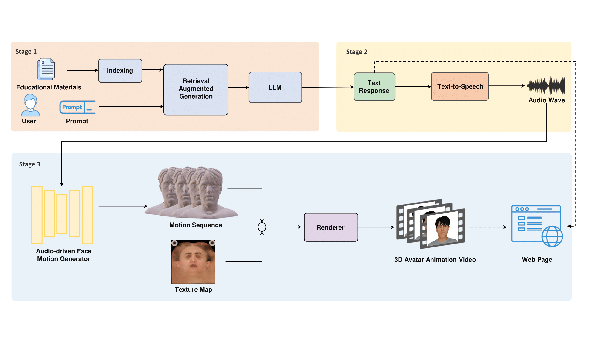

# Embodied-AI-Guided-Interactive-Digital-Teacher-for-Education
[Paper](https://dl.acm.org/doi/10.1145/3680533.3697070)

[SIGGRAPH Asia 2024 Educator's Forum] Official implementation of the paper "Embodied AI-Guided Interactive Digital Teacher for Education"

We propose MAGI, a novel system providing Embodied AI-Guided Interactive digital teachers for education, which integrates LLM-based chatbot technology. To ensure MAGI generates answers without hallucination, we employ a novel
retrieval-augmented generation (RAG) paradigm to organize and retrieve useful educational documents for the LLM. Moreover, we create animatable 3D avatars powered by text-to-speech and audio-to-motion models to provide students with interactive conversation experiences. We highlight the possibility of MAGI to enhance education accessibility and improve the overall learning experience.

# TODO List
- [ ] Release the full system code
- [ ] Release the model checkpoints
- [ ] Release the demo video and presentation video
